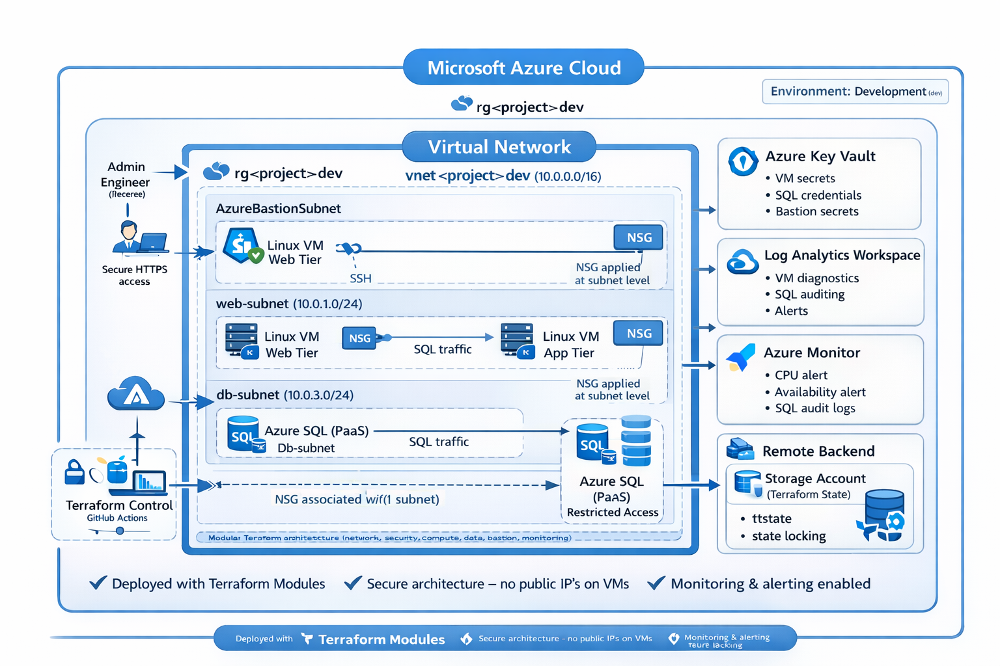
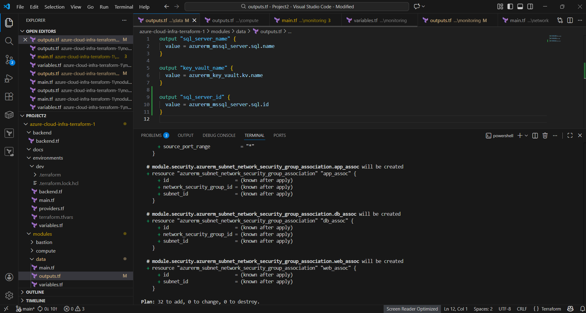

## Enterprise-Scale Azure Infrastructure with Terraform

This project showcases a production-ready Azure infrastructure deployed using Terraform, featuring:

- Secure networking configurations

- A robust multi-tier architecture

- Integrated monitoring and alerting

- Remote state management for collaboration and security


## Architecture





## Terraform Project Structure (VS Code)

The screenshot below shows the modular Terraform repository structure

used to provision Azure infrastructure following best practices.




## What this project demonstrates

- Infrastructure as Code using Terraform modules

- Secure Azure network design (VNet, subnets, NSGs, Bastion)

- Multi-tier Linux architecture (web & app layers)

- Azure SQL data layer

- Secrets management with Azure Key Vault

- Monitoring, diagnostics and alerting with Azure Monitor

- Remote backend and state locking

- Production-style environment separation


## High-level architecture

This project deploys a secure, enterprise-style Azure environment:

- Virtual Network with segmented subnets (web, app, data, bastion)

- Linux web VM exposed via controlled NSG rules

- Linux application VM isolated from the internet

- Azure SQL Server used as the data layer

- Azure Bastion for secure administrative access

- Azure Key Vault for secret management

- Log Analytics Workspace for centralized monitoring

- Azure Monitor alerts for operational visibility

All infrastructure is deployed using reusable Terraform modules.


## Repository structure

azure-cloud-infra-terraform-1/

```

│
├── backend/                 # Remote state backend configuration
├── environments/
│   └── dev/                 # Development environment (root module)
├── modules/
│   ├── network/             # VNet, subnets, routing
│   ├── security/            # NSGs and security rules
│   ├── compute/             # Linux VMs and NICs
│   ├── data/                # Azure SQL and data services
│   ├── bastion/             # Secure access layer
│   └── monitoring/          # Log Analytics and alerts
│
└── docs/
    └── architecture.png


## Technologies used

- Microsoft Azure

- Terraform

- Azure Virtual Network

- Azure Bastion

- Azure Monitor & Log Analytics

- Azure Key Vault

- Azure SQL

- Linux (Ubuntu)


## Deployment guide

### Prerequisites

- Azure subscription

- Azure CLI installed and authenticated

- Terraform installed

### Steps

git clone https://github.com/Shakol91/azure-cloud-infra-terraform-1.git

cd azure-cloud-infra-terraform/environment/dev

terraform init

terraform validate

terraform plan

terraform apply


## Security design

- No public IPs on virtual machines

- Access only through Azure Bastion

- Network Security Groups isolate each subnet

- Secrets stored in Azure Key Vault

- Remote Terraform state stored securely in Azure Storage

- SQL protected inside private network


## Monitoring & operations

- Log Analytics Workspace collects diagnostics

- VM and SQL monitoring enabled

- Azure Monitor alerts configured (CPU, availability)

- Centralized observability for troubleshooting


## Design decisions

- Modular Terraform structure for scalability and reuse

- Subnet separation to follow enterprise network patterns

- Bastion instead of public IPs for secure management

- Remote backend to support teamwork and automation

- Monitoring added from day one to simulate production readiness


## Author

Osatuyi Adekunle

Cloud Engineer (Azure)

AZ-104 Certified: Azure Administrator Associate

AZ-900 Certified: Azure Fundamentals

MS-900 Certified: Microsoft Fundamentals

 